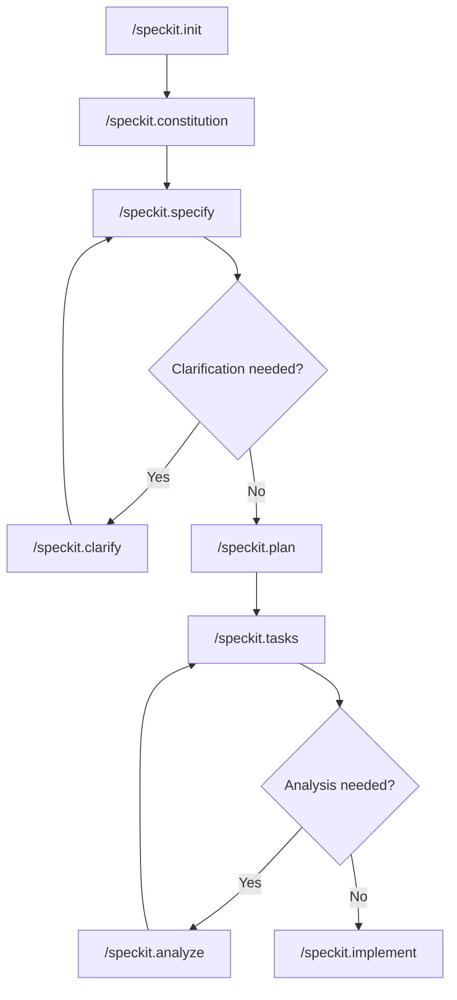

# Spec-Driven Development

This skill provides the core methodology for Spec-Driven Development (SDD) - a development approach where specifications are executable and directly generate working implementations.

## What is Spec-Driven Development?

Spec-Driven Development flips the script on traditional software development. Instead of treating specifications as scaffolding to discard once coding begins, SDD makes specifications the primary artifact that drives implementation.

## The SDD Workflow

### Step 1: Initialize (`/speckit.init`)
Set up the project with spec-kit structure including templates, scripts, and memory.

### Step 2: Constitution (`/speckit.constitution`)
Define project principles and development guidelines that govern all subsequent development.

### Step 3: Specify (`/speckit.specify`)
Describe WHAT you want to build and WHY. Focus on user value, not technical implementation.

**Good**: "Users can upload photos organized into albums"
**Bad**: "Create a React component using AWS S3 for storage"

### Step 4: Clarify (`/speckit.clarify`)
Resolve ambiguities in the specification through targeted questions. Maximum 5 questions per session.

### Step 5: Plan (`/speckit.plan`)
Translate the specification into technical architecture, data models, and API contracts.

### Step 6: Tasks (`/speckit.tasks`)
Break the plan into actionable, dependency-ordered tasks organized by user story.

### Step 7: Analyze (`/speckit.analyze`)
Validate consistency across spec, plan, and tasks before implementation.

### Step 8: Implement (`/speckit.implement`)
Execute all tasks according to the plan, following TDD and phase-by-phase validation.

## Key Principles

### Specifications First
- Write specifications before any code
- Focus on user outcomes, not technical solutions
- Make requirements testable and measurable

### Technology Independence
- Specifications should be technology-agnostic
- Technical decisions are made in the planning phase
- This separation allows better decision-making

### Incremental Delivery
- User stories are implemented independently
- Each story is a complete, testable increment
- MVP first, then iterate

### Constitution Governance
- Project principles are non-negotiable
- All development must align with constitution
- Changes require explicit amendment process

## When to Use This Skill

- Starting a new feature or project
- Formalizing informal requirements
- Training team members on SDD methodology
- Auditing existing development processes
